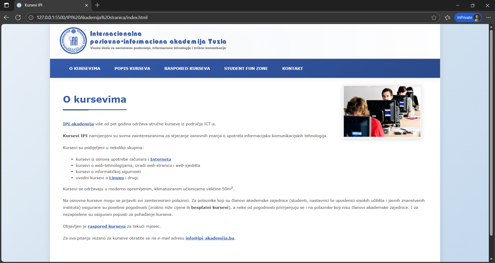
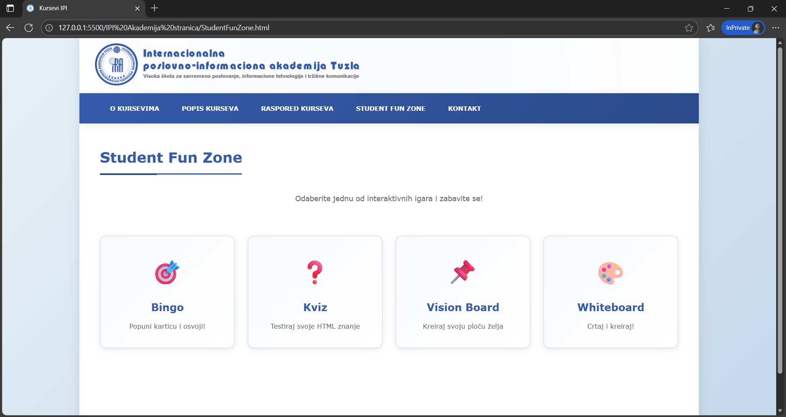
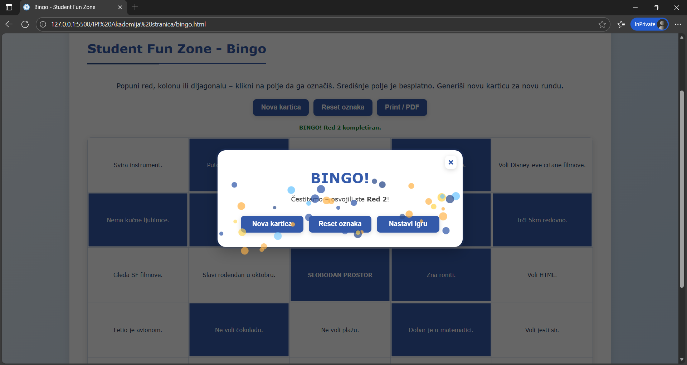
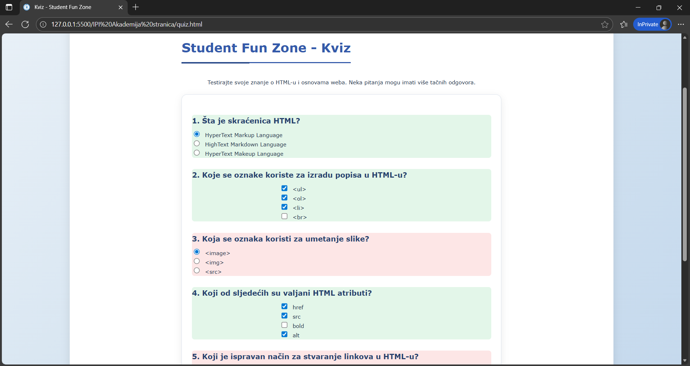
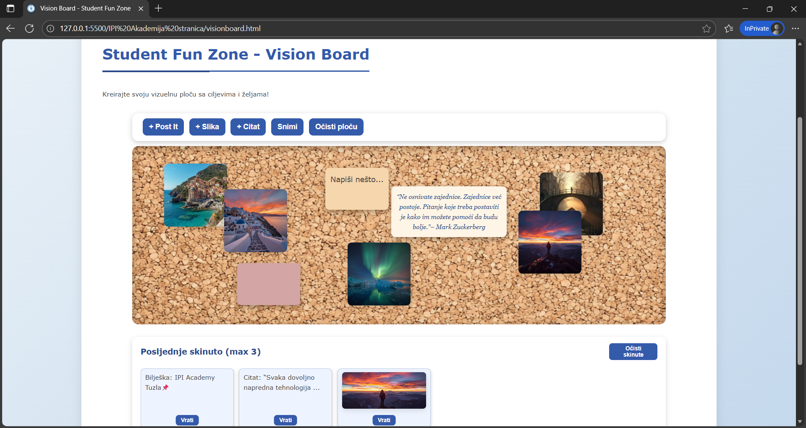
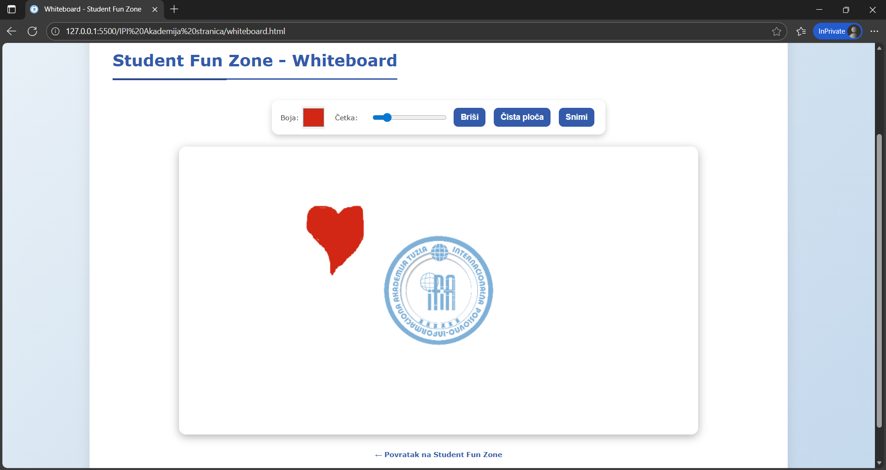
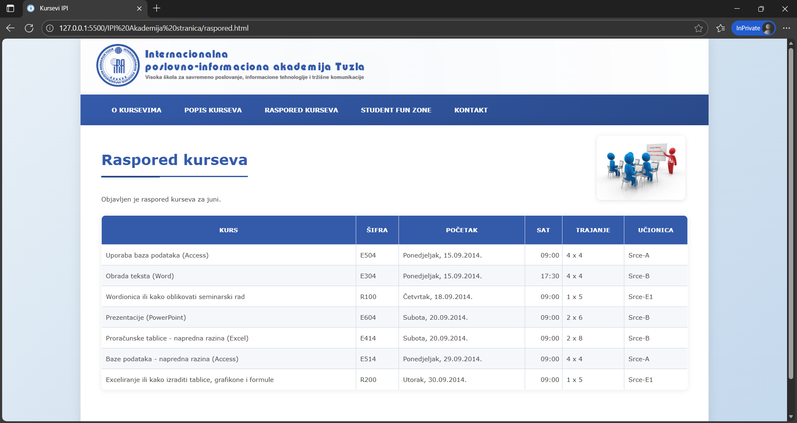
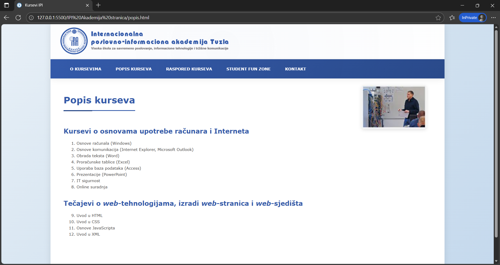
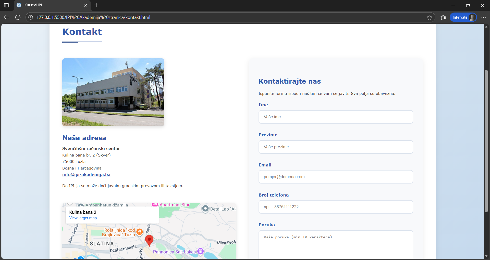

# Web Programming: Project 1

**Course:** Web Programming (semester project)  
**Institution:** Internacionalna poslovno-informaciona akademija (IPI Academy), Tuzla

A modern, unified web interface combining an academy informational site with four interactive mini‑apps: **Bingo**, **Quiz**, **Vision Board** and **Whiteboard**. Built with HTML5, CSS3 and vanilla JavaScript; styled with a unified blue gradient theme; enhanced with celebratory win overlays (modals + confetti).

## 1) Project Overview

This project was developed throughout the semester for the **Web Programming** course at IPI Academy. The goal is to create an engaging, accessible web experience that combines practical academy information (schedule, contact, program listings) with four interactive mini‑games designed to boost student engagement and demonstrate core web development skills—DOM manipulation, event handling, local storage, canvas drawing and responsive design—without relying on frameworks or build tools.

## 2) Project Structure

```
ipi akademija stranica/        # Main site directory
  index.html                   # Academy landing page
  popis.html                   # Course listing
  raspored.html                # Schedule with floating image
  kontakt.html                 # Contact form + map
  StudentFunZone.html          # Hub linking to mini-games

  bingo.html                   # Bingo game UI
  quiz.html                    # Quiz game UI
  visionboard.html             # Vision Board app
  whiteboard.html              # Whiteboard canvas app

  css/
    izgled.css                 # Global theme & animations
    bingo-style.css
    quiz-style.css
    visionboard-style.css
    whiteboard-style.css

  bingo-app.js                 # Bingo logic & win modal
  quiz-app.js                  # Quiz grading & overlay
  visionboard-app.js           # Vision Board interactions
  whiteboard-app.js            # Canvas drawing logic

  slike/                       # Brand images & illustrations
    logo-ipi.png
    (other academy visuals)

visionboard/slike/             # Sample images for Vision Board
whiteboard/slike/              # Logo watermark for Whiteboard
screenshots/                   # Project documentation images
```

## 3) Mini-Games: Detailed Explanation

### 🎲 Bingo

**Purpose:** A classic 5×5 Bingo game with randomized number generation and win detection.

**Features:**

- **Card Generation:** Click "Generate Card" to create a new 5×5 grid. The center cell is always marked as a **free space** (B‑I‑N‑G‑O rules).
- **Marking Cells:** Click any cell to toggle its marked state (visual highlight).
- **Win Detection:** After each click, the game checks:
  - All 5 cells in any **row**
  - All 5 cells in any **column**
  - Both **diagonals** (top‑left to bottom‑right & top‑right to bottom‑left)
- **Victory UX:** When you win, a **full‑screen modal overlay** appears with:
  - Congratulatory message
  - Action buttons ("Play Again")
  - **Confetti animation:** Lightweight `<div>` dots spawn at randomized positions across the modal and animate downward (CSS keyframe fall + fade) for a celebratory effect.
- **State Guard:** Once won, the modal won't re‑trigger until you start a new game (prevents duplicate overlays).

**Technical Notes:**

- Pure vanilla JS; no external libraries.
- Confetti dots are dynamically appended to the modal card with randomized X/Y positions for uniform visual spread.
- Grid numbers are generated per standard Bingo column ranges (B: 1–15, I: 16–30, etc.) or can be customized for term-based variants.

---

### 📝 Quiz

**Purpose:** A multiple‑choice / input quiz testing HTML, CSS and web programming knowledge; includes advanced answer normalization and a perfect‑score celebration.

**Features:**

- **Questions:** Covers topics like HTML tags, CSS selectors, semantic markup and code snippets (e.g., recognizing `<a href="...">` syntax).
- **Answer Collection:** Mix of radio buttons and text inputs.
- **Normalization Pipeline:** User answers are cleaned before grading:
  1. Trim leading/trailing whitespace
  2. Collapse multiple internal spaces into one
  3. Remove stray backslashes (common copy‑paste artifact)
  4. Normalize spacing around `=` signs (e.g., `href = "..."` → `href="..."`)
  - This ensures minor formatting differences don't cause incorrect grading.
- **Scoring & Feedback:** Click "Submit" to see your score. If you answer **all questions correctly**, a **full‑screen overlay** appears with:
  - "Perfect Score!" message
  - Options to "Continue" or "Restart Quiz"
- **Future Extension:** Roadmap includes showing incorrect answers with explanations (currently only final score is displayed).

**Technical Notes:**

- Answers stored in a JavaScript object; grading function compares normalized user input against answer key.
- Modal overlay system reused from Bingo (consistent design pattern).

---

### 🎨 Vision Board

**Purpose:** A digital collage tool for curating goals, inspiration and affirmations. Students can visually organize their aspirations by adding notes, images and quotes.

**Features:**

- **Toolbar Controls:**
  - **+ Post It:** Adds a draggable sticky note (editable text; random pastel color from palette).
  - **+ Slika (Image):** Inserts a random sample image from `visionboard/slike/` (10 curated visuals).
  - **+ Citat (Quote):** Adds an inspirational tech‑themed quote (3 pre‑loaded quotes, extendable).
  - **Snimi (Save):** Persists the current board state to **localStorage** (positions, content, element types).
  - **Očisti ploču (Clear Board):** Removes all items after confirmation.
- **Interaction:**
  - **Drag to Arrange:** Click and hold any note/image/quote to reposition it on the canvas.
  - **Edit Content:** Notes and quotes are `contentEditable`; click inside to type/modify text.
  - **Remove Item:** Each element has a **📌 pin button**. Clicking it:
    - Removes the item from the board
    - Adds it to **"Posljednje skinuto (Recently Removed)"** tray (max 3 items)
    - Items in the tray show a **"Vrati (Restore)"** button to bring them back to the board at a new random position.
  - **Clear Recent Tray:** Button to empty the "Recently Removed" list.
- **Persistence:** Board state auto-loads on page refresh (from localStorage).

**Use Case:** Students create a motivational dashboard with their semester goals, favorite tech quotes and inspirational images; visual reminder of their learning journey.

**Technical Notes:**

- Each element (`div.note`, `div.pinned-img`, `div.quote`) has absolute positioning; drag logic updates `style.left` and `style.top`.
- Recent tray uses a separate localStorage key; array stores serialized element data (type, className, innerHTML, position).

---

### ✏️ Whiteboard

**Purpose:** A freeform sketching canvas for brainstorming, diagramming, quick notes. Supports mouse, touch and stylus input.

**Features:**

- **Drawing Canvas:** HTML5 `<canvas>` (900×500px default) with pointer event listeners.
- **Toolbar Controls:**
  - **Boja (Color Picker):** Choose any stroke color (default: IPI blue `#345AAA`).
  - **Četka (Brush Size):** Range slider (1–20px) adjusts line width.
  - **Briši / Crtaj (Eraser Toggle):**
    - Click **"Briši"** to enter eraser mode (draws in white to "erase").
    - Button text changes to **"Crtaj"** while erasing; click again to return to draw mode.
  - **Čista ploča (Clear Canvas):** Wipes the entire canvas clean (canvas `clearRect`).
  - **Snimi (Save):** Downloads the canvas as a **PNG image** (`moj_crtez.png`) using `canvas.toDataURL()`.
- **Watermark:** On page load, a semi‑transparent **IPI logo** (`whiteboard/slike/logo-ipi-square.png`) is drawn centered on the canvas at 50% opacity, subtle branding that doesn't interfere with sketches.
- **Drawing Logic:**
  - **Mouse:** `mousedown` starts drawing, `mousemove` continues, `mouseup` ends.
  - **Touch:** `touchstart`, `touchmove`, `touchend` for mobile/tablet support.
  - Coordinates scaled to match canvas internal resolution vs. display size (handles responsive layouts).

**Use Case:** Students sketch algorithms, wireframes, flowcharts, or quick notes during study sessions; export drawings for assignments or collaboration.

**Technical Notes:**

- Canvas 2D context (`ctx.lineTo`, `ctx.stroke`).
- Eraser mode simply changes `strokeStyle` to `#FFFFFF` (canvas background color).
- No undo/redo yet (roadmap feature: history stack for strokes).

## 4) Getting Started

**No installation required.** This is a static web project - just open the HTML files in a modern browser.

1. **Clone or download** this repository.
2. Navigate to `ipi akademija stranica/` folder.
3. Open `index.html` in **Chrome**, **Firefox**, or **Edge**.
4. Explore:
   - Academy pages: Home, Course Listing, Schedule, Contact
   - Click **Student Fun Zone** to access the mini‑games.

**Optional:** Serve via a lightweight local server (e.g., Python's `http.server` or VS Code Live Server) for a more production‑like experience, though it's not necessary for core functionality.

## 5) Screenshots to Capture

<div align="center">

<table>
  <tr>
    <td align="center">
      
      <br><b>Home Page</b><br><sub>Landing page: header, navigation, hover underline</sub>
    </td>
    <td align="center">
      
      <br><b>Student Fun Zone</b><br><sub>Mini-games hub selection screen</sub>
    </td>
    <td align="center">
      
      <br><b>Bingo Win</b><br><sub>Victory modal with confetti animation</sub>
    </td>
  </tr>
  <tr>
    <td align="center">
      
      <br><b>Quiz</b><br><sub>Quiz interface with questions and Submit button</sub>
    </td>
    <td align="center">
      
      <br><b>Vision Board</b><br><sub>Notes, image, quote, Recently Removed tray</sub>
    </td>
    <td align="center">
      
      <br><b>Whiteboard</b><br><sub>Drawn strokes, toolbar, watermark logo centered</sub>
    </td>
  </tr>
  <tr>
    <td align="center">
      
      <br><b>Schedule</b><br><sub>Schedule page with table and floating image</sub>
    </td>
    <td align="center">
      
      <br><b>Course Listing</b><br><sub>Popis page: all available courses</sub>
    </td>
    <td align="center">
      
      <br><b>Contact</b><br><sub>Contact form and embedded Google Map</sub>
    </td>
  </tr>
</table>

</div>

## 6) Contact & Disclaimer

[](https://www.linkedin.com/in/demir-halilbasic/) [](https://www.youtube.com/@DemkyDesignHub)

**Disclaimer:**  
Some photos and illustrations used in this project are AI‑generated for aesthetic purposes. All **IPI Academy logos** and visual identity elements (`logo-ipi.png` and related materials) are the exclusive property of Internacionalna poslovno-informaciona akademija Tuzla, and are displayed here for non‑commercial, informational and academic purposes only.

For removal or correction of any brand element, please contact the project maintainer.
